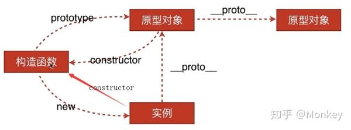

# JS里的原型到底是个什么东西
## 首先要明确下面2点
- **虽然js里有class这个东西，也可以近似像java那样写关于类的代码，这是没错的**
- **但是js里是不存在类的，它的本质其实是构造函数和原型链的语法糖**

先来看一个基本的构造函数
```javascript
function Person(name = '人') {
  this.name = name
}

const p1 = new Person('小明')
console.log(p1) // Person { name: '小明' }
```
现在给构造函数中的`this`添加一个方法：`say()`

可以看到，两个实例`p1`和`p2`的`say`方法是不相等的，而每创建一个实例，都会额外创建一个新的函数，这样显然是不好的，需要有一种方法，使得创建的实例的方法是共享的
```javascript
function Person(name = '人') {
  this.name = name
  this.say = function() {
    console.log(`大家好，我是：${this.name}`)
  }
}

const p1 = new Person('小明')
const p2 = new Person('小刚')
console.log(p1, p2) // Person { name: '小明', say: [Function] } Person { name: '小刚', say: [Function] }
p1.say() // 大家好，我是：小明
p2.say() // 大家好，我是：小刚
console.log(p1.say === p2.say) // false
```
于是，原型对象就出现了

js中一切都是对象，所以函数也是对象，所有的函数都会拥有一个`prototype`属性，这个属性指向的对象是这个函数的原型对象，构造函数的原型对象上的属性和方法都会被它的实例所继承
```javascript
function Person(name = '人') {
  this.name = name
}
Person.prototype.say = function() {
  console.log(`大家好，我是：${this.name}`)
}

const p1 = new Person('小明')
const p2 = new Person('小刚')
console.log(p1, p2) // Person { name: '小明' } Person { name: '小刚' }
p1.say() // 大家好，我是：小明
p2.say() // 大家好，我是：小刚
console.log(p1.say === p2.say) // true
```
而原型对象上有一个属性`constructor`，保存的是它的那个构造函数的引用

所以下面可以看到`Person.prototype`把原型对象给指了出来，但又被`Person.prototype.constructor`给指了回去
```javascript
function Person(name = '人') {
  this.name = name
}

console.log(Person.prototype.constructor = Person) // true
```
那构造函数的实例有什么办法可以获取到生成它的构造函数吗？

是可以的，每个实例上都会有`constructor`属性，直接指向了它的构造函数的原型对象，同时呢每个实例上都会有一个`__proto__`属性，直接指向了它的构造函数的原型对象，再通过`constructor`指回来它的构造函数就行
```javascript
function Person(name = '人') {
  this.name = name
}
const p1 = new Person('小明')
console.log(p1 instanceof Person) // true
console.log(p1.constructor === Person) // true
console.log(p1.__proto__.constructor === Person) // true
```
所以呢这就形成了一个环，如下图

<!--  -->

但最终原型链应该是一个“链”

也就是说可以顺着原型对象一直指下去，对的

原型对象本身也具有`__proto__`属性，直接指向了它的构造函数，当一个实例调用它的方法在它的构造函数中找不到时，就回去原型对象上去找，当原型对象找到不的时候就会去原型对象的原型对象上去找，直到原型链的尽头。